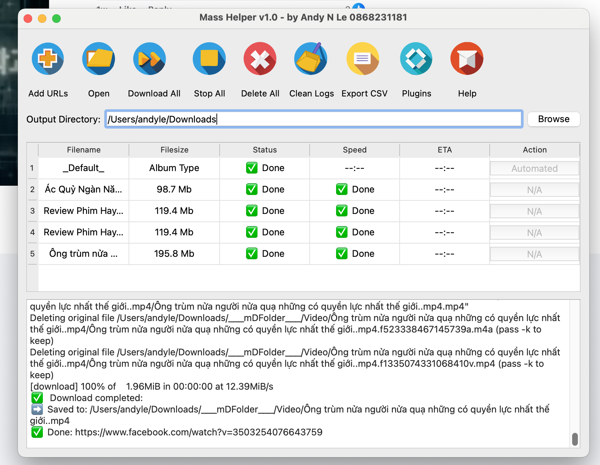

# masshelper
Intercept downloads and show button on images/video sites, including HDVietnam,facebook, youtube ,tiktok, instagram ,flickr ,fshare ,4share , mediafire , dropbox ,onedrive ,google drive, huggingface.co , liblib.art, shakker.ai, civitai.com, ...

  

# A HTTP download manager

Mass Helper is a HTTP(s) download manager that supports downloading HTTP from video sites: facebook.com , youtube.com , tiktok.com , instagram.com ,dailymotion.com , vimeo ,... image sites: flickr.com,500px,behance.net,... file sites: fshare.vn,dropbox.com, google drive, onedrive, 4share, hdvn, mediafire,...

Mass helper has a clean and easy to use interface. I hope you will like it 👻.

## 💽 Installation 

Download Mac OS or Windows version from [Mass Helper App]([(https://github.com/laichaoyi/masshelper/releases/tag/1.1))](Mass Helper releases) and install it.

## ✨ Features

- 🕹 Simple and clear user interface
- 🦄 Supports download videos & images from many sites 
- ☑️ Need massdownloader-extension chrome extension to help
- 📡 Support download file/folder from fshare,4share, googledrive, mediafire,dropbox,onedrive,...
- 🔌 Suport export to .CSV file list for uploading to other sites (google drive, fshare,onedrive,...)
- 🎛 Up to 10 concurrent download tasks
- 🚀 Supports 16 threads in a single task
- 🛠 More features in development

## 📜 License

[MIT](https://opensource.org/licenses/MIT) Copyright (c) 2025 Andy N Le
